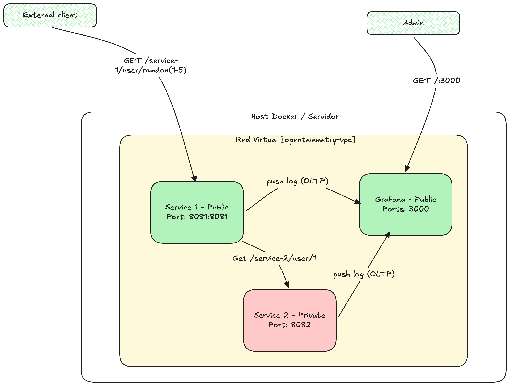
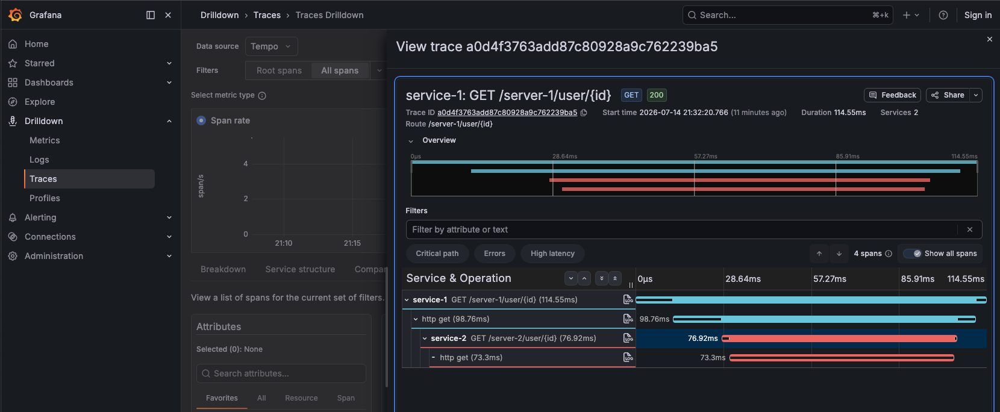

# spring-boot-opentelemetry-grafana-otel-lgtm

En este ejempo muestro como implementar **[opentelemetry]** con [String Boot 4].

Antes que todos, vamos a revisar varios putntos importantes para compreder como funciona todo esto.

### Dependencias
La dependencia inical para configurar **[opentelemtry]** es la siguiente:

```
implementation 'org.springframework.boot:spring-boot-starter-opentelemetry'
```

Esta depedencia permite obtener metricas, trazados y logs de forma simplificada al incluir todas las dependencias necesaris de OpenTelemtry.

### Micrometer
Micrometer es una biblioteca que actua como fachada para la recopilacion metricas. Esto le pemrite enviar ddatos a **[OpenTelemetry]** usando el protocolo **[OTLP]**.

Una novedad importan te es que pemrite recopilar datos mediante anotaciones; ahora es posible utilizar **[@Observer]** en los metodos y capturar argumetnos especifico como **"key-values"** usando la anotacion **[@ObservationKeyValue]** directamente en los parametros de los metodos.

### Propagación de Trazas
Al utilizar las API de llamadas a servicios como **[RestClient]** o **[WebClient]** la propagacion de trazas de hace automaticamente y el desarrollador de debe hacer ninguna configuracion exta, no sdebe evitar crear los @Bean como new. La manera correcta es la siguiente:

```
@Bean
public RestClient restClient(RestClient.Builder restClientBuilder) {
    return restClientBuilder
    .baseUrl("http://observer2:8081/server-2")
    .build();
}
```
La realizar la injección con [RestClient.Builder] Spring de encarga de ajustar la propagacion de trazas de extremo a entremo.

### Configuración de Propiedades.

La integracion facilita el envio de datos aun colector de **[OpenTelemetry]** medinates propidades muy sencillas de configurar, en loa cual podemos elegir el endpoint de exportación y el protocolo **[HTTP o gRPC]**.


### Arquitectura del Proyecto



* Service-1: Servicio público que se encarga de recibir la solicitud, posterior realiza una solicitud al **[servicio 2]** con el cliente rest **[RestClient]**.

* Service-2: Recibe la solicituid del **[service-1]** y porterior hace una solicutd a un servicio de externo para consultar a un usuario.

**NOTA:** El servicio **[service-1]** esta expuesto, miestra el **[service-2]** solo es accesible por el [service-1].


### Construir y Levantar el Proyecto

#### Construir las imagenes

```
bash build.sh
```
Contiene todas las instrucciones necesarias para constuir los jar, y levantar el docker compose con todas las imagenes necesarias.


### Ejecutar Pruebas.

Ya existe un archivo llamamado **[run.sh]** el cual contiene un script bash para realizar una solicitud rest hacia el api de usuario.

```
bash run.sh 10
```
Donde 10, es el numero de peticiones que le haras al API de mock definido.

### Visualizar en el tablero 

Utilizamos la imagen de docker **[grafana/otel-lgtm]** que contiene la pila completa de observabilidad para **OpenTelemetry**. Estas incluyen [Loki] para registros, Grafana para la visualziacion, Tempo[trazas] y Prometheus [Metricas].

Tambien cuenta con **[OpenTelemetry Collector]** para la recopilacion y tratamiento de los datos de telemetria. 

